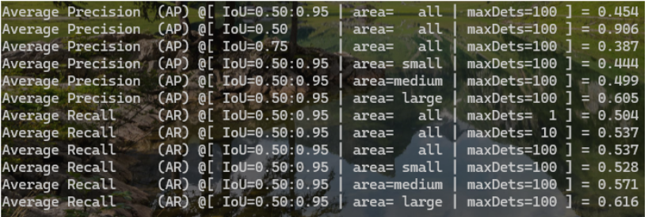
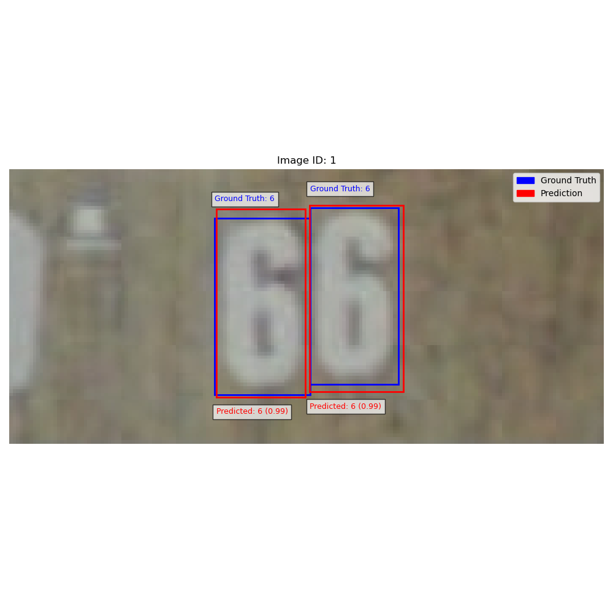
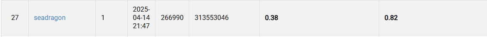

# Visual-Recognition-using-Deep-Learning-HW2

### StudentID: 313553046
### Name: 馬國維

## Introduction
In this assignment, task1 is to detect each digit in the image and task2 is to recognize the entire digit in the image. We need to output the digit bbox and category.For this assignment,  I use a pretrained model fasterrcnn_resnet50_fpn and pretrained weight provided by torchvision.

## How to install
git clone https://github.com/seeadragon/Visual-Recognition-using-Deep-Learning-HW2

## Requirements
Python                    3.9.21  
pytorch-cuda              11.8  
torchvision               0.20.1  
numpy                     2.0.1  

## Usage
### modify in main.py
### For training
main.py: model.train()
### For evaluating
main.py: model.eval()
### For testing
main.py: model.test()

## config
config = {
        'device': 'cuda' if torch.cuda.is_available() else 'cpu',
        'num_classes': 11,
        'pretrained': True,
        'num_epochs': 10,
        'batch_size': 2,
        'learning_rate': 4e-5,
        'weight_decay': 5e-5,
        'optimizer': optim.AdamW,
        'log_dir': 'log/visualization',
    }

## Hardware Specifications
CPU: 12th Gen Intel(R) Core(TM) i5-12400F  
GPU: NVIDIA GeForce RTX 3050

## Result

